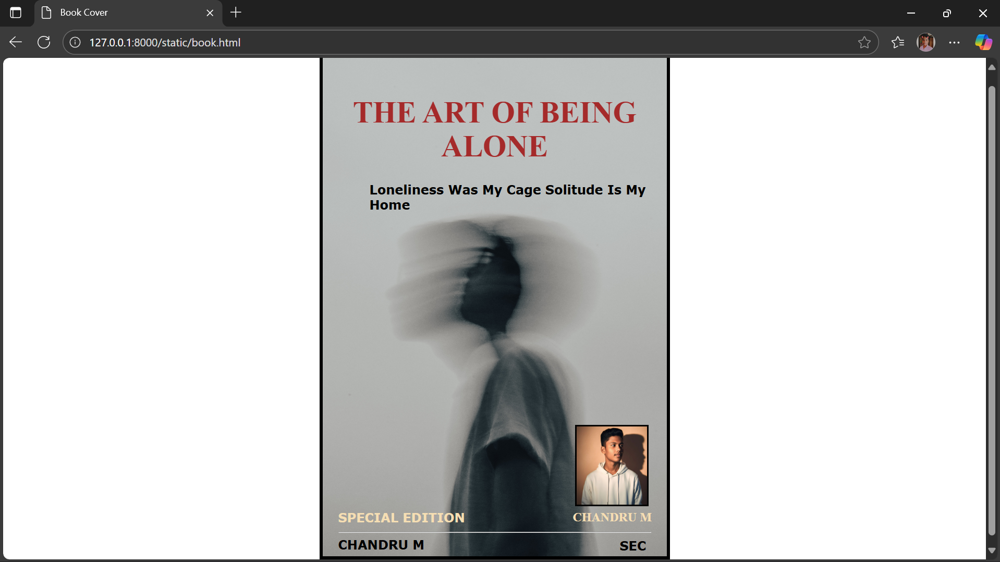

# Ex.06 Book Front Cover Page Design
## Date: 28.10.2025

## AIM:
To design a book front cover page using HTML and CSS.

## DESIGN STEPS:

### Step 1:
Create a Django Admin project.

### Step 2:
Create an app in the Django interface.

### Step 3:
Create a folder named 'static' in the app folder.

### Step 4:
Create a new HTML file in the static folder.

### Step 5:
Write the HTML code with relevant CSS properties.

### Step 6:
Choose the appropriate style and color scheme.

### Step 7:
Insert the images in their appropriate places.

### Step 8:
Publish the website in the LocalHost.

## PROGRAM:

## book.html

```python 
<!DOCTYPE html>
<html>
    <head>
        <title>Book Cover</title>
    
    <style>
    .bookcover{
        border: 4px solid black;
        width: 400px;
        height: 600px;
        position: relative;
        color:black;
        margin-left: auto;
        margin-right: auto;
        padding: 20px;
        font-family: ' Arial, sans-serif';
        background-image: url(background.png);
        background-size: cover;
    }
    .authorname{ 
        position: relative;
        color: wheat;
        top:255px;
        left:300px;
        font-size: medium;
    }
    .title{
        color:brown;
        font-family: Roquen;
        font-size: larger;
        text-align: center;
        position: relative;
        top: 5px;
    }
    .line {
        width:400px;
        position: relative;
        top:300px; 
    }
    .by{
        color: black;
        font-size: medium;
        font-family: Verdana;
        position:relative;
        top:250px;
    }
    .edition{
        color: wheat;
        font-size: medium;
        font-family: Verdana;
        position:relative;
        top:175px;
        
    }
    .subtitle{
        color:black;
        font-family: Verdana;
        font-size: small;
        position: relative;
        left:40px;
        top:3px;
    }
    .photo{
        
        border: 2px solid black;
        position: relative;
        top: 275px;
        left: 303px;
        width: 90px;
        height: 100px;
        background-size:contain;
    }
    .sec{
        color: black;
        font-size: medium;
        font-family: Verdana;
        position:relative;
        top:170px;
        left:360px;
    } 
    

     
    </style>
    </head>
    <body>
    <div class="bookcover">
        <div class="title">
            <h1>THE ART OF BEING ALONE</h1>
        </div>
        <div class="subtitle">
            <b>Loneliness Was My Cage Solitude Is My Home</b>
        </div>
        <div class="photo">
            
        </div>
        
        <div class="line">
            <hr>
        </div>
        <div class="authorname">
            <p><b>CHANDRU M</b></p>
        </div>
        <div class="by">
            <h4>CHANDRU M</h4>
        </div>
        <div class="edition">
            <h4>SPECIAL EDITION</h4>
        </div>
        <div class="sec">
            <h4>SEC</h4>
        </div>
    </div>
     
    </body>
</html>    
```

## OUTPUT:



## RESULT:

The program for designing book front cover page using HTML and CSS is completed successfully.
